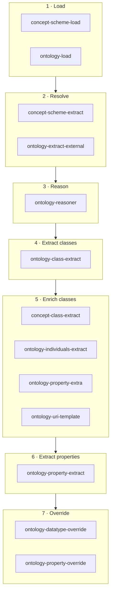

# Adapters

Adapters build the model that generators render. Before a generator writes anything it runs a
pipeline of adapters: one loads the ontology file, the next fetches imported vocabularies, the next
runs a reasoner, and so on until there is a complete set of classes, properties, cardinalities and
concepts in memory. Nothing about the ontology reaches a generator except through this pipeline.

You control the pipeline in two places:

- `adapters.<name>.enabled` turns an adapter off globally.
- `generators.<name>.adapters` restricts one generator to a subset.

## What an adapter is

An adapter is a class extending `AbstractAdapter<T extends AbstractInfo>` with a single method:

```java
public abstract T adapt(T info);
```

There are two `AbstractInfo` types in play, and both are shared across the whole run:

| Info object | Built from | Holds |
| --- | --- | --- |
| `OntologyInfo` | `ontology.ontology-file-path` | The Jena model, the inferred model, external ontologies, and the extracted `ClassInfo` / `PropertyInfo` tree |
| `ConceptSchemeInfo` | `ontology.concepts-file-path` | The concept-scheme model and the extracted class and property concepts |

Each adapter declares which type it handles through its constructor, and `canAdapt` checks the
instance before `adapt` is called. Adapters mutate the object they receive rather than returning a
copy, so the pipeline is a chain of in-place enrichments: `ontology-load` puts a model on
`OntologyInfo`, `ontology-class-extract` reads that model and adds classes, `ontology-property-extract`
reads those classes and adds properties, and so on. An adapter that runs too early simply finds
nothing to work with.

## The pipeline

Adapters do not run in the order you declare them. Each adapter carries an `@AdapterDependency`
annotation listing the adapters it needs, and `AdapterDependencyComparator` sorts the list before
every run: an adapter always follows everything it transitively depends on, and adapters at the
same dependency depth are ordered by class name. This is the resulting order.



### 1. `concept-scheme-load`

Reads the file at `ontology.concepts-file-path` into a Jena model and puts it on
`ConceptSchemeInfo`. Handles `ConceptSchemeInfo`; does nothing to the ontology.

### 2. `ontology-load`

Reads the file at `ontology.ontology-file-path` into a Jena model and puts it on `OntologyInfo`.
Every other ontology adapter depends on this, directly or transitively.

### 3. `concept-scheme-extract`

Lists every `skos:Concept` in the concept-scheme model. Concepts carrying `owl:equivalentClass`
become class concepts; concepts carrying `owl:equivalentProperty` — or an `owl:equivalentClass`
that points at a property URI — become property concepts. Both lists are stored on
`ConceptSchemeInfo`.

### 4. `ontology-extract-external`

Collects every `owl:imports` statement in the ontology model and fetches each referenced vocabulary
over HTTP, trying configured mirrors when the original URI fails. Results are parsed into models
and registered as external ontologies on `OntologyInfo`, and cached on disk so later runs do not
re-download them. See [`adapters.ontology-extract-external`](#adapters-ontology-extract-external).

### 5. `ontology-reasoner`

Builds a union view of the base model and every fetched external model, runs a Jena reasoner over
it, and stores the result as the inferred model on `OntologyInfo`. Downstream adapters prefer the
inferred model when it exists, which is what makes inherited superclasses, inverse properties and
imported restrictions visible. The inferred model can be cached on disk and optionally dumped to a
file. See [`adapters.ontology-reasoner`](#adapters-ontology-reasoner).

### 6. `ontology-class-extract`

Lists every resource typed `owl:Class` and turns it into a `ClassInfo`, then walks
`rdfs:subClassOf` to add superclasses — reading the inferred model when the reasoner ran, the base
model otherwise. `owl:Restriction` nodes are skipped, since they are constraints rather than
superclasses. Superclasses in a different namespace than the subclass are marked as external scope,
which is how generators later tell your own classes apart from imported ones.

### 7. `concept-class-extract`

For every class concept that has no matching class in the ontology yet, creates a `ClassInfo` for
the concept's equivalent class URI, attaches the properties whose `rdfs:domain` is that class, and
then drops any of those properties that has no matching property concept. This is what pulls
concept-scheme-only classes into the generated model.

### 8. `ontology-individuals-extract`

For each extracted class, lists the resources declared with `rdf:type <class>` in the ontology model
and records them as that class's individuals. Generators use these to build enumerations.

### 9. `ontology-property-extra`

Adds each entry of `ontology.extra-properties` as a property on every class that does not already
have that URI, carrying over the configured name, comment, range, cardinality and identifier flag.
Use it for columns that must exist in the output but are not modelled in the ontology, such as a
`uri` column.

### 10. `ontology-uri-template`

For each ontology class that carries a `hydra:search` property, parses the linked Hydra template —
`hydra:template` plus the `hydra:mapping` entries with their `hydra:variable` and `hydra:property`
— into a `UriTemplate` on the class. The variable-to-property mapping is what
`ontology-property-extract` later uses to decide which properties are identifiers.

### 11. `ontology-property-extract`

The main extraction step. For each class it collects properties from two sources: the
`owl:Restriction` nodes on `rdfs:subClassOf`, and the `owl:ObjectProperty` / `owl:DatatypeProperty`
declarations. Properties with the same URI are merged, keeping the strongest cardinality bounds and
the union of ranges. It then marks the properties named by the class's URI template as identifiers
(creating them if absent) and resolves `owl:inverseOf` for every property.

### 12. `ontology-datatype-override`

Rewrites property ranges according to `ontology.override-datatypes`. Each entry maps one RDF
datatype URI to another RDF datatype URI — for example `rdfs:Literal` to `xsd:string`. It does not
map to SQL or language-specific types; that translation happens inside the generators.

### 13. `ontology-property-override`

Applies `ontology.override-properties`. For each entry it finds every property with the matching
URI on any class and replaces the configured fields: `name`, `comment`, `range` (falling back to
`datatype` when `range` is absent), `cardinality` and `identifier`. Fields you leave out are kept
as extracted. Running last means these values win over everything the pipeline inferred.

## Enabling and disabling adapters

Every adapter is on by default. Turn one off with:

```yaml
adapters:
  ontology-individuals-extract:
    enabled: false
```

The flag is read directly from the configuration file at bootstrap; a disabled adapter is never
instantiated, so it also never appears in any generator's list. Disabling an adapter that others
depend on removes its effect from the whole run — switching off `ontology-reasoner`, for example,
makes every downstream adapter fall back to the raw model, which is a legitimate way to get a fast
run over a self-contained ontology.

Turning off `ontology-load` or `concept-scheme-load` leaves the corresponding model null, and the
adapters after it will have nothing to read.

## Selecting adapters per generator

By default a generator runs every enabled adapter. Add an `adapters` list to run a subset:

```yaml
generators:
  shacl:
    adapters:
      - "ontology-load"
      - "ontology-class-extract"
      - "ontology-property-extract"
```

The lookup key is the **generator name**, not the generator's config prefix. Use
`generators.shacl.adapters`, never `generators.shacl-generator.adapters`:

| Generator | Adapter selection key |
| --- | --- |
| `class` | `generators.class.adapters` |
| `sql` | `generators.sql.adapters` |
| `shacl` | `generators.shacl.adapters` |
| `java` | `generators.java.adapters` |
| `typescript` | `generators.typescript.adapters` |
| `bikeshed` | `generators.bikeshed.adapters` |
| `odcs` | `generators.odcs.adapters` |
| `data-frame` | `generators.class.adapters` (shared with `class`; it has no list of its own) |
| `class-diagram` | not usable — see below |
| `er-diagram` | not usable — see below |

::: danger Never put `adapters` under `class-diagram` or `er-diagram`
For these two the generator name and the config prefix are the same string, so the same section is
also bound to a typed properties class. The configuration binder uses a strict Jackson mapper, so
an unknown key throws `IllegalArgumentException: Unrecognized field "adapters"` and the run aborts
before any generator starts. Let these two generators run the full pipeline instead.
:::

An empty or missing list means "all enabled adapters". Names that are unknown or disabled are
skipped with a warning, and the subset is still sorted by dependency order, so listing adapters in
the wrong order is harmless.

This selection path has no test coverage and no sample configuration exercises it. Check the log
line that names each adapter as it runs to confirm you got the pipeline you intended.

## `adapters.ontology-reasoner`

| Key | Default | Meaning |
| --- | --- | --- |
| `enabled` | `true` | Run the reasoner at all |
| `rules-file` | `""` | Path to a Jena rules file; when set, a `GenericRuleReasoner` is built from it and `reasoner-type` is ignored. If the file fails to load, the configured reasoner type is used instead |
| `reasoner-type` | `"owl"` | `owl` (OWL Micro), `rdfs` (lighter and faster) or `transitive`. Anything else falls back to OWL Micro |
| `reasoner-materialize` | `false` | Call `InfModel.prepare()` to materialise all inferences up front |
| `reasoner-timeout-ms` | `0` | Abort reasoning after this many milliseconds; `0` disables the timeout |
| `inferred-cache-enabled` | `true` | Cache the inferred model on disk between runs |
| `inferred-cache-ttl-ms` | `3600000` | Cache entry lifetime in milliseconds; `0` or less means never expire |
| `inferred-cache-dir` | `target/cache/inferred` | Directory for cached inferred models |
| `inferred-cache-format` | `TURTLE` | Jena language name used to read and write cache entries |
| `inferred-output-enabled` | `false` | Also write the inferred model to a file of your choice |
| `inferred-output-path` | `""` | Destination for that file; only used when `inferred-output-enabled` is `true` |

```yaml
adapters:
  ontology-reasoner:
    enabled: true
    rules-file: "src/test/resources/examples/reasoner.rules"
    reasoner-type: "owl"
    reasoner-materialize: true
    reasoner-timeout-ms: 0
    inferred-cache-enabled: true
    inferred-cache-ttl-ms: 3600000
    inferred-cache-dir: "target/cache/inferred"
    inferred-cache-format: "TURTLE"
    inferred-output-enabled: true
    inferred-output-path: "target/inferred/inferred.ttl"
```

Reasoning over a large imported vocabulary is the slowest part of a run. Leave the cache on, and
switch `reasoner-type` to `rdfs` when you do not need OWL inference.

## `adapters.ontology-extract-external`

| Key | Default | Meaning |
| --- | --- | --- |
| `enabled` | `true` | Follow `owl:imports` at all |
| `connect-timeout-ms` | `2000` | HTTP connect timeout |
| `read-timeout-ms` | `5000` | HTTP read timeout |
| `max-retries` | `1` | Retries per candidate URI |
| `follow-redirects` | `true` | Follow HTTP redirects |
| `user-agent` | `oddtoolkit/1.0` | `User-Agent` header sent with each request |
| `cache-enabled` | `true` | Cache downloaded ontologies on disk |
| `cache-ttl-ms` | `3600000` | Cache entry lifetime in milliseconds; `0` or less means never expire |
| `cache-max-entries` | `100` | Maximum number of cached entries |
| `cache-dir` | `target/cache/ontology-extract-external` | Cache directory; a blank value disables the file cache |
| `cache-format` | `TURTLE` | Jena language name used to read and write cache entries |
| `mirrors` | empty | Alternative download locations, tried after the original URI |

Each `mirrors` entry has:

| Key | Meaning |
| --- | --- |
| `uri` | The imported ontology URI this entry applies to |
| `mirrors` | List of alternative locations, tried in order |
| `mirror` | Single alternative location; used only when `mirrors` is absent |

Mirrors matter because many vocabulary URIs do not serve RDF over content negotiation. The original
URI is always tried first, then each mirror in turn.

```yaml
adapters:
  ontology-extract-external:
    cache-enabled: true
    cache-dir: "target/cache/external"
    cache-ttl-ms: 3600000
    mirrors:
      - uri: "http://www.w3.org/ns/prov#"
        mirrors:
          - "https://www.w3.org/ns/prov-o"
      - uri: "http://xmlns.com/foaf/0.1/"
        mirrors:
          - "https://xmlns.com/foaf/spec/index.rdf"
      - uri: "http://www.w3.org/ns/adms#"
        mirror: "https://www.w3.org/ns/legacy_adms.ttl"
```

If you work offline, set `enabled: false` and make sure your ontology file is self-contained.

## Other adapters

The remaining eleven adapters take no configuration of their own beyond `enabled`. They read
`ontology.*` — `extra-properties`, `override-properties`, `override-datatypes` and the rest — which
is documented in the [Configuration Reference](./configuration).

## See also

- [Generators](./generators) — what consumes the model this pipeline builds
- [Configuration Reference](./configuration) — the `ontology.*` keys the adapters read
- [Extension Guide](./extending) — writing your own adapter and registering it
