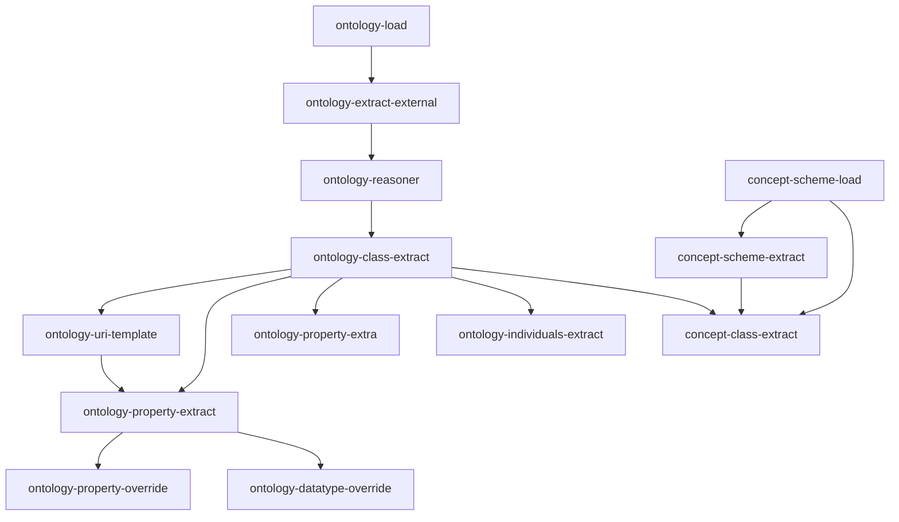
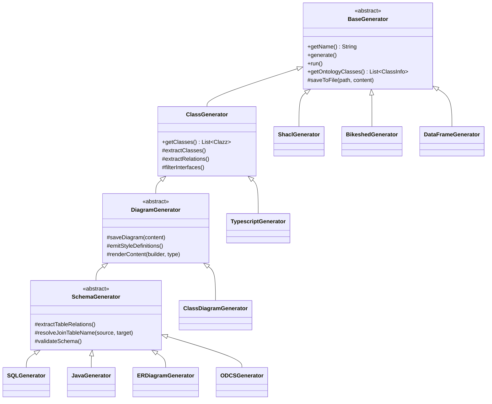

# Architecture

This page describes how ODDToolkit is put together, so you can reason about a run or debug one.
For task-oriented material see [Generators](./generators), [Adapters](./adapters) and
[Extending](./extending).

## Shape of the application

ODDToolkit is a plain Java 21 command-line application. It reads RDF with Apache Jena, binds
configuration with Jackson, and writes files. That is the whole runtime.

There is **no Spring container**, no component scanning and no service discovery. Every object is
constructed by hand in `config/OddtoolkitBootstrap.java`. `@ConfigPrefix` and
`@ConditionalOnConfigProperty` are the project's own annotations — they look like Spring's, but
they are read by a few lines of reflection in `ConfigurationBinder` and `OddtoolkitBootstrap`, not
by a framework. The practical consequence: if a generator or adapter is not mentioned in
`OddtoolkitBootstrap`, it does not exist at runtime.

Packages:

| Package | Responsibility |
| --- | --- |
| `cli` | `GeneratorCliRunner` — picks and executes generators |
| `config` | Argument parsing, config loading and binding, the bootstrap, the generator registry |
| `adapter` | The 13 pipeline stages that read and enrich the model |
| `generator` | The 10 generators and their base classes |
| `model` | `OntologyInfo`, `ConceptSchemeInfo` and the info objects hanging off them |
| `util` | Mermaid PNG export, Markdown loading and Bikeshed conversion |

## Bootstrap sequence

`OddtoolkitApplication.main` does two things: build a registry, then run the CLI.

```java
GeneratorRegistry registry = OddtoolkitBootstrap.bootstrap(args);
new GeneratorCliRunner(registry).run(args);
```

```mermaid
sequenceDiagram
  autonumber
  participant M as OddtoolkitApplication.main
  participant B as OddtoolkitBootstrap
  participant S as ConfigurationSourceResolver
  participant C as ConfigurationBinder
  participant G as GeneratorConfiguration
  participant R as DefaultGeneratorRegistry
  participant CLI as GeneratorCliRunner

  M->>B: bootstrap(args)
  B->>B: CliConfiguration.fromArgs(args)
  B->>S: loadFromFile(configFile)
  S-->>B: Map&lt;String, Object&gt; (empty if absent)
  B->>C: bind(root, OntologyConfiguration, …)
  C-->>B: typed properties POJOs
  B->>B: applyCliOverrides(ontology/concepts paths)
  B->>B: new OntologyInfo(config)
  B->>B: createAdapterBeans() → filter by enabled
  B->>G: one factory call per generator
  G-->>B: generator + its selected, sorted adapters
  B->>R: register(generator.getName(), generator)
  B-->>M: GeneratorRegistry
  M->>CLI: run(args)
  CLI->>CLI: CliConfiguration.fromArgs(args) again
  CLI->>R: get(name) / getAvailableGenerators()
  CLI->>CLI: generator.generate() → run()
```

Things worth knowing about that sequence:

- **The arguments are parsed twice.** `OddtoolkitBootstrap.bootstrap` parses them to find
  `--config-file`, `--ontology-file` and `--concepts-file`; `GeneratorCliRunner.run` parses the
  same array again to find `--generator` and `--help`. Both use `CliConfiguration.fromArgs`.
- **Bootstrap always runs, even for `--help`.** The registry — and therefore every generator and
  every adapter instance — is constructed before the help check. A failure while constructing
  adapters shows up even when you only asked for help.
- **`validate()` is never called by the CLI.** `GeneratorCliRunner` calls `generate()`, which
  delegates straight to `run()`. `BaseGenerator.validate()` and `ODCSGenerator.validate()` exist
  but are only reachable from tests or your own code.
- **Every generator shares one `OntologyInfo` instance and one set of adapter instances.** They
  are created once in `bootstrap` and handed to all ten generators. With `--generator=all` the
  runner executes the generators in alphabetical order and each one re-runs its adapter list
  against that same, already-populated model.

## Configuration binding

Configuration is a two-step affair: load a file into a nested `Map`, then bind subtrees of that
map onto typed POJOs.

`ConfigurationSourceResolver.loadFromFile` picks a Jackson mapper from the file extension —
`.json`, `.yml` or `.yaml`. Anything else, a missing file, or a parse error produces a **warning
and an empty map**; the run then continues on code defaults. If a run behaves as if your config
did not exist, check the extension and the path first.

`ConfigurationBinder.bind` reads the `@ConfigPrefix` annotation on the target class, walks that
dot-path through the map, and converts the resulting subtree with a Jackson `ObjectMapper`
configured with `PropertyNamingStrategies.KEBAB_CASE`. That is where the `kebab-case` key
convention comes from: `outputFile` in Java is `output-file` in YAML.

Two behaviours follow from the implementation:

- If the section is missing or empty, `bind` returns the default instance it was handed and
  Jackson never runs.
- If the section exists, `bind` converts it into a **new** instance. Keys you omitted fall back to
  the field initialisers on the POJO, not to the object you passed in. So partial sections are
  safe, but the defaults that apply are the ones declared in the properties class.

`@ConfigPrefix` classes and their prefixes:

| Prefix | Class |
| --- | --- |
| `ontology` | `OntologyConfiguration` |
| `adapters.ontology-reasoner` | `OntologyReasonerProperties` |
| `adapters.ontology-extract-external` | `OntologyExtractExternalAdapter.ExtractExternalProperties` |
| `generators.class-diagram` | `ClassDiagramProperties` |
| `generators.er-diagram` | `ERDiagramProperties` |
| `generators.diagram-generator` | `DiagramGeneratorProperties` |
| `generators.schema-generator` | `SchemaGeneratorProperties` |
| `generators.sql-generator` | `SQLGeneratorProperties` |
| `generators.java-generator` | `JavaGeneratorProperties` |
| `generators.typescript-generator` | `TypescriptGeneratorProperties` |
| `generators.shacl-generator` | `ShaclGeneratorProperties` |
| `generators.data-frame-generator` | `DataFrameGeneratorProperties` |
| `generators.bikeshed-generator` | `BikeshedGeneratorProperties` |
| `generators.odcs-generator` | `ODCSGeneratorProperties` |

The `generators` section is read a second time, untyped, by
`OddtoolkitBootstrap.readGeneratorMap` into `GeneratorProperties`. That raw copy is what supplies
the per-generator `adapters` list. It is keyed by a **different** name than the typed properties
class for most generators:

| Generator | `adapters` list read from | Typed settings read from |
| --- | --- | --- |
| `class` | `generators.class` | — |
| `data-frame` | `generators.class` | `generators.data-frame-generator` |
| `class-diagram` | `generators.class-diagram` | `generators.class-diagram` |
| `er-diagram` | `generators.er-diagram` | `generators.er-diagram` |
| `sql` | `generators.sql` | `generators.sql-generator` |
| `shacl` | `generators.shacl` | `generators.shacl-generator` |
| `java` | `generators.java` | `generators.java-generator` |
| `typescript` | `generators.typescript` | `generators.typescript-generator` |
| `bikeshed` | `generators.bikeshed` | `generators.bikeshed-generator` |
| `odcs` | `generators.odcs` | `generators.odcs-generator` |

Note the two oddities: `data-frame` picks up the adapter list configured for `class`, and the
schema/code generators read their `adapters` list from the short key while their settings live
under the `-generator` key. If a custom `adapters` list appears to be ignored, that mismatch is
the usual cause.

See [Configuration Reference](./configuration) for the field-by-field reference.

## Adapter pipeline

An adapter is a subclass of `AbstractAdapter<T extends AbstractInfo>` with one abstract method:

```java
public abstract T adapt(T info);
```

`AbstractAdapter` knows the `Class<T>` it can handle, which drives `canAdapt(AbstractInfo)`.
`BaseGenerator.run()` walks its adapter list and, for each adapter, offers it both the
`OntologyInfo` and the `ConceptSchemeInfo`; an adapter runs against whichever of the two it
declares. Adapters mutate the info objects in place and return them.

`OddtoolkitBootstrap.createAdapterBeans` instantiates all 13 adapters into a `LinkedHashMap` keyed
by name, then drops the disabled ones. Enablement is decided by
`@ConditionalOnConfigProperty(prefix = "adapters", name = "<name>.enabled", havingValue = "true",
matchIfMissing = true)` — every adapter currently carries one, so every adapter defaults to
enabled and is switched off with `adapters.<name>.enabled: false`. Adapters without the annotation
fall back to the same `adapters.<name>.enabled` lookup.

### Ordering

`GeneratorConfiguration.selectAdapters` decides which adapters a generator gets: the whole enabled
set if the generator configures no `adapters` list, otherwise only the named ones (unknown names
are logged and skipped). Either way the result is sorted with `AdapterDependencyComparator`.

That comparator uses the `@AdapterDependency({SomeAdapter.class, …})` annotations:

1. If one adapter transitively declares a dependency on the other, it sorts after it.
2. Otherwise the adapters are ordered by declared dependency **depth** — the longest chain of
   `@AdapterDependency` hops from the class. An adapter with no annotation has depth 0 and
   therefore sorts to the front.
3. Ties are broken by fully-qualified class name, so the order is deterministic.

This is a comparator, not a topological sort. It works because the declared dependency graph is
shallow and consistent, and because the two loaders (`OntologyLoadAdapter`,
`ConceptSchemeLoadAdapter`) declare nothing and land at depth 0. A new adapter that forgets its
`@AdapterDependency` inherits that same depth 0 and will run **before** the ontology is loaded —
its `info.getModel()` will be `null`. See [Extending](./extending).

The declared dependency graph today:



Arrows point from a dependency to the adapter that declares it. See [Adapters](./adapters) for
what each stage actually does and its settings.

## Generator hierarchy

Generators are a four-level inheritance chain. Each level adds a model and leaves rendering to the
level below.



What each layer contributes:

**`BaseGenerator`** holds the three things every generator needs: the `OntologyInfo`, the
`ConceptSchemeInfo` and the ordered adapter list. Its `run()` is the pipeline execution itself —
it iterates the adapters and calls `adapt` on each. It also provides `getName()` (which
kebab-cases the simple class name after stripping a trailing `Generator`), `saveToFile`, the
sorted `getOntologyClasses()` / `getAllClasses()` accessors, concept lookup helpers such as
`getClassConceptForClass`, and the `toSnakeCase` / `toKebabCase` utilities. `generate()` simply
delegates to `run()`.

**`ClassGenerator`** turns the raw ontology model into a language-neutral class model: lists of
`Clazz`, `Interface` and `Enum`, each with `Attribute`s that carry a data type, range classes and
a cardinality. Its `run()` calls `super.run()` first — so the adapters execute — and then
`extractClasses`, `extractInterfaces`, `extractEnums`, `extractMetadataClasses`,
`extractRelations`, the filters (inverse properties, interfaces, inherited properties, enums),
surrogate keys, identifier fallbacks, range resolution and a final ordering pass that makes output
deterministic.

**`DiagramGenerator`** (abstract) adds `DiagramGeneratorProperties`: the style map built from
`generators.diagram-generator.styles`, the shared `generate(String type)` template that renders a
Mermaid document, and `saveDiagram(...)`. `saveDiagram` writes the diagram to the configured
`output-file`, prints it to stdout when no output file is set, and — unless
`export-png: false` — renders a PNG next to it via `MermaidExporter`, which drives a headless
browser through Playwright. If the Playwright runtime is missing, the PNG step logs a warning and
is skipped; the `.mmd` file is still written.

**`SchemaGenerator`** (abstract) adds the relational model on top of the class model: `Table`,
`Column` and `Relation`. Its `run()` extends the chain with `updateEnums`, `extractTables`,
`extractTableRelations`, an ordering pass and `validateSchema()`. This is the layer that owns
identifier-column resolution, `xsd:` to SQL type mapping, snake_case naming, inheritance
flattening, identity tables, many-to-many join tables and the join-table naming patterns from
`generators.schema-generator`. Everything a SQL schema, a JPA entity, an ER diagram and an ODCS
contract have in common lives here — which is why those four generators cannot disagree about
table names or keys.

The leaf generators are thin by comparison: they walk the model their base class prepared and
append strings to a `StringBuilder`.

## Model objects

The adapters and generators pass around two long-lived objects, both created in `bootstrap`.

`AbstractInfo` is the common base. It carries `uri`, `name`, `label`, `comment`, the originating
Jena `Resource` and a `Scope` (`ONTOLOGY` or `CONCEPTS`); `name`, `label` and `comment` are
initialised from the resource's local name, `rdfs:label` and `rdfs:comment`. Equality is by URI.

`OntologyInfo` is the primary model. It owns:

- `config` — the bound `OntologyConfiguration`, which is how adapters reach `ontology.*` settings
  such as `override-properties` and `surrogate-keys`;
- `concepts` — a `ConceptSchemeInfo`, created in the same constructor;
- `classesByUri` — a `LinkedHashMap` of `ClassInfo`, so insertion order is stable and duplicate
  URIs are ignored (`getClasses()` returns a snapshot list, `addClass()` is the way to add);
- `model` — the Jena `Model` populated by `ontology-load`;
- `inferredModel` — the Jena `InfModel` populated by `ontology-reasoner`;
- `externalOntologies` — nested `OntologyInfo` instances for imports fetched by
  `ontology-extract-external`.

`ConceptSchemeInfo` is the SKOS side: its own `config`, its own Jena `model` loaded by
`concept-scheme-load`, plus `classConcepts` and `propertyConcepts`. Generators use it through
`BaseGenerator.getClassConceptForClass` and `getPropertyConceptForProperty` to attach human labels
and descriptions from the vocabulary to classes and properties.

Below those sit `ClassInfo`, `PropertyInfo`, `ClassConceptInfo`, `PropertyConceptInfo`,
`Cardinality` and `UriTemplate`. They are mutable POJOs — adapters enrich them in place, which is
why the pipeline order matters so much.

## Debugging a run

- Turn up logging with the `ODD_LOG_LEVEL` environment variable; `logback.xml` binds it to the
  `be.vlaanderen.omgeving` logger. At `DEBUG` you see each adapter as it runs
  (`Running adapter: …` is logged by `BaseGenerator.run` at `INFO`).
- Empty or default-looking output usually means the config file was not read. Check for the
  `Configuration file not found` or `Unsupported configuration file format` warning.
- An adapter that appears not to run may have been filtered out by
  `adapters.<name>.enabled: false`, or excluded by an explicit `adapters` list on the generator —
  in the latter case look for the `Requested adapter '…' is not available or is disabled` warning.
- Duplicate column names and similar structural problems are caught by
  `SchemaGenerator.validateSchema()`, which throws with the offending table named.

## See also

- [Adapters](./adapters) — per-adapter behaviour and settings
- [Generators](./generators) — per-generator output and settings
- [Extending](./extending) — adding your own adapter or generator
- [Configuration Reference](./configuration) — the full key reference
