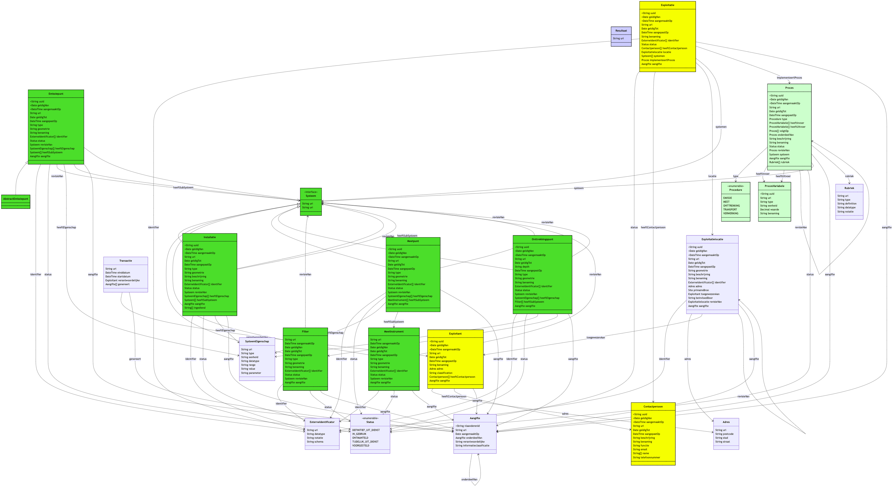
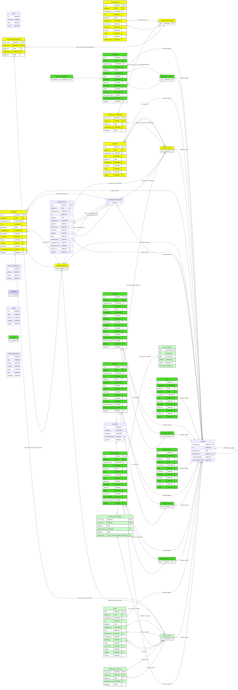

# Generated Examples

Every artefact on this page was produced by the generator tests from one ontology and one
configuration file. Nothing here is hand-written, so it shows exactly what the toolkit emits.

- **Ontology:** `docs/examples/riepr/ontology/ns/riepr/riepr.ttl`
- **Concept scheme:** `docs/examples/riepr/ontology/id/concept/riepr/riepr.ttl`
- **Configuration:** `src/test/resources/application.yml`
- **Outputs:** `docs/examples/riepr/outputs/`

The configuration is a complete worked example in its own right — see
[Configuration](./configuration) for what each key does.

## Refreshing these examples

The generator tests write to `target/test-cache`; the script copies the results into the
documentation and regenerates the diagram include-partials.

```bash
./mvnw -Dtest='ClassDiagramGeneratorTest,ERDiagramGeneratorTest,SQLGeneratorTest,ShaclGeneratorTest,JavaGeneratorTest,TypescriptGeneratorTest,DataFrameGeneratorTest,BikeshedGeneratorTest,ODCSGeneratorTest' test
./scripts/update-doc-examples.sh
```

If a generator output is missing the script lists every missing file and stops, rather than
failing halfway through. PNG export needs a Playwright browser; when it is unavailable the script
keeps the committed images and warns. See [Generators](./generators#diagram-generator) for
`export-png`.

## Class diagram

Generated by `class-diagram` into `class-diagram.mmd`.

<!--@include: ../examples/riepr/outputs/class-diagram.mermaid.md-->

The same diagram is also exported as a PNG when `export-png` is enabled:



## ER diagram

Generated by `er-diagram` into `er-diagram.mmd`. Note that this is Mermaid, not PlantUML.

<!--@include: ../examples/riepr/outputs/er-diagram.mermaid.md-->



## SQL schema

Generated by `sql` into `schema.sql`.

<<< ../examples/riepr/outputs/schema.sql

## SHACL shapes

Generated by `shacl` into `schema.ttl`. The output is Turtle.

<<< ../examples/riepr/outputs/schema.ttl

## Java model

Generated by `java` into a directory of classes; this is one of them.

<<< ../examples/riepr/outputs/Exploitatie.java

## TypeScript model

Generated by `typescript` into a directory of modules; this is one of them.

<<< ../examples/riepr/outputs/exploitatie.model.ts

## DataFrame

Generated by `data-frame` into `frame.json`.

<<< ../examples/riepr/outputs/frame.json

## Data contract (ODCS)

Generated by `odcs` into `contract.json`, following the Open Data Contract Standard.

<<< ../examples/riepr/outputs/contract.json

## Bikeshed specification

Generated by `bikeshed` into `ontology.bs`. This is Bikeshed *source*: render it to a W3C-style
HTML specification with the [`bikeshed` CLI](https://speced.github.io/bikeshed/) or the
[online API](https://api.csswg.org/bikeshed/).

<<< ../examples/riepr/outputs/ontology.bs
