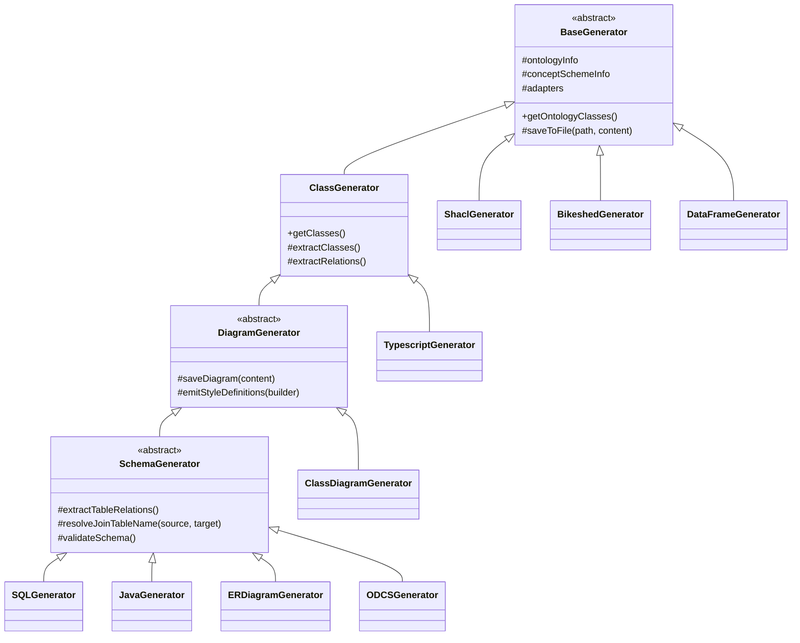

# Extension Guide

This guide shows how to add custom generators and adapters in the current bootstrap-based architecture.

## Architecture overview

At runtime the flow is:

1. `OddtoolkitApplication` starts the process
2. `OddtoolkitBootstrap` loads and binds configuration
3. Adapters are created and filtered (enabled/disabled)
4. Generators are created with selected adapters
5. `GeneratorCliRunner` executes the chosen generator(s)

There is no Spring container in this project; registration is done in code.

There is also no `ServiceLoader`, SPI or plugin directory. Adding a generator or an adapter means
editing `OddtoolkitBootstrap` and rebuilding the jar from source — you cannot drop a class on the
classpath and have it picked up. Plan for a fork or a patch, not a plugin.

::: warning Removed helper
`config/GeneratorRegistrationHelper.java` no longer exists. It was dead code with zero callers and
has been deleted. If you find it referenced in an older document or branch, ignore it and register
generators directly in `OddtoolkitBootstrap` as shown below.
:::

For a fuller description of the bootstrap sequence, the configuration binder and the adapter
ordering rules, see [Architecture](./architecture).

## Pick the right base class

Generators form a four-level chain. Pick the lowest level that already gives you the model you
need — every level below `BaseGenerator` costs you nothing but gives you a lot.



| Extend | When your output is | What you get |
| --- | --- | --- |
| `BaseGenerator` | Driven by raw ontology classes and properties — RDF, a specification document, JSON | `ontologyInfo`, `conceptSchemeInfo`, the adapter list, `getOntologyClasses()`, `saveToFile()` |
| `ClassGenerator` | Object-oriented: classes, interfaces, enums, inheritance | Everything above, plus a built `Clazz` / `Interface` / `Enum` model with attributes, ranges and cardinalities |
| `DiagramGenerator` | A Mermaid diagram | Everything above, plus `generators.diagram-generator` styles, `saveDiagram()`, stdout fallback and PNG export |
| `SchemaGenerator` | Relational or persisted: SQL, ORM entities, ER diagrams, data contracts | Everything above, plus `Table` / `Column` / `Relation`, primary-key resolution, join and identity tables, `xsd:` to SQL type mapping and `validateSchema()` |

::: danger Extending `BaseGenerator` gives you no schema model
The example below extends `BaseGenerator` because it only counts classes. That is the right choice
for a trivial generator, but it is the wrong default. A `BaseGenerator` subclass has **no**
`getClasses()`, no `Table`, no `Column`, no join-table logic and no type mapping — you would have
to re-derive table names, primary keys and foreign keys yourself, and your output would then be
free to disagree with the SQL, Java, ER and ODCS generators.

If your generator emits anything table-shaped, extend `SchemaGenerator`. If it emits anything
class-shaped, extend `ClassGenerator`. Only extend `BaseGenerator` when you genuinely want the raw
ontology and nothing else.
:::

Whichever base class you pick, if you override `run()` you must call `super.run()` **first**. That
is what executes the adapter pipeline and populates the model your base class exposes.

## Add a custom generator

### 1) Create a generator class

Create a class that extends `BaseGenerator`.

```java
package be.vlaanderen.omgeving.oddtoolkit.generator;

import be.vlaanderen.omgeving.oddtoolkit.adapter.AbstractAdapter;
import be.vlaanderen.omgeving.oddtoolkit.model.ConceptSchemeInfo;
import be.vlaanderen.omgeving.oddtoolkit.model.OntologyInfo;
import java.util.List;

public class MarkdownSummaryGenerator extends BaseGenerator {

  public MarkdownSummaryGenerator(
      OntologyInfo ontologyInfo,
      ConceptSchemeInfo conceptSchemeInfo,
      List<AbstractAdapter<?>> adapters) {
    super(ontologyInfo, conceptSchemeInfo, adapters);
  }

  @Override
  public String getName() {
    return "markdown-summary";
  }

  @Override
  public void run() {
    super.run();
    String content = "# Classes\n\nTotal: " + getOntologyClasses().size();
    saveToFile("target/summary.md", content);
  }
}
```

The `getName()` override above is optional. `BaseGenerator.getName()` strips a trailing
`Generator` from the simple class name and kebab-cases the rest, so `MarkdownSummaryGenerator`
already resolves to `markdown-summary` on its own — just as `ERDiagramGenerator` resolves to
`er-diagram` and `DataFrameGenerator` to `data-frame`. Override it only when you want a name the
convention would not produce. Whatever the method returns is the name you pass to `--generator=`
and the key the generator is registered under, so keep it stable.

### 2) Wire it in `GeneratorConfiguration`

Add a factory method in `GeneratorConfiguration` similar to existing generators.

### 3) Register it in `OddtoolkitBootstrap`

Instantiate the generator and register it in `DefaultGeneratorRegistry`:

```java
registry.register(markdownSummaryGenerator.getName(), markdownSummaryGenerator);
```

### 4) Run it

```bash
java -jar target/oddtoolkit.jar --generator=markdown-summary --config-file=config.yml
```

## Add a custom adapter

### 1) Create adapter class

Adapters extend `AbstractAdapter<T>` where `T` is an `AbstractInfo` subtype.

```java
package be.vlaanderen.omgeving.oddtoolkit.adapter;

import be.vlaanderen.omgeving.oddtoolkit.model.OntologyInfo;

public class OntologyAuditAdapter extends AbstractAdapter<OntologyInfo> {

  public OntologyAuditAdapter() {
    super(OntologyInfo.class);
  }

  @Override
  public OntologyInfo adapt(OntologyInfo info) {
    // Add enrichment/validation logic here.
    return info;
  }
}
```

### 2) Declare its dependencies

::: danger An adapter without `@AdapterDependency` runs too early
Adapter order is decided by `AdapterDependencyComparator`, which reads the
`@AdapterDependency` annotation on each adapter class. An adapter that declares nothing has
dependency depth 0 — the same depth as `OntologyLoadAdapter` — and sorts to the **front** of the
pipeline. It will then run before the ontology is loaded, and `info.getModel()` will be `null`.
:::

The example above is deliberately dependency-free. Any real adapter needs the annotation:

```java
@AdapterDependency({
    OntologyClassExtractAdapter.class
})
public class OntologyAuditAdapter extends AbstractAdapter<OntologyInfo> {
```

Declare the last stage you need to have completed, not every stage. The comparator follows the
annotations transitively, so depending on `OntologyClassExtractAdapter` also places you after
`ontology-load`, `ontology-extract-external` and `ontology-reasoner`. Ties between adapters with
the same depth and no relation are broken by class name, so ordering stays deterministic.

The existing dependency graph is documented in [Architecture](./architecture#adapter-pipeline).

### 3) Add it to adapter creation

Register it in `OddtoolkitBootstrap#createAdapterBeans` using a stable key:

```java
allAdapters.put("ontology-audit", new OntologyAuditAdapter());
```

### 4) Make it optional via config (optional)

If needed, annotate with `@ConditionalOnConfigProperty` or rely on:

```yaml
adapters:
  ontology-audit:
    enabled: true
```

### 5) Select it per generator

```yaml
generators:
  class-diagram:
    adapters:
      - "ontology-load"
      - "ontology-audit"
      - "ontology-class-extract"
```

Two things to watch when you write that list. The key is the generator's **short** name, which is
not always the key its typed settings use: `sql` selects adapters from `generators.sql` but reads
its settings from `generators.sql-generator`. And `data-frame` has no adapter key of its own — it
reads `generators.class.adapters`. Omit the list entirely and the generator receives every enabled
adapter, correctly ordered, which is usually what you want.

## Best practices

- Keep adapters focused on data extraction/transformation.
- Keep generators focused on rendering/exporting output.
- Use deterministic ordering in outputs where possible.
- Add tests for new adapter behavior and generator output.
- Prefer config toggles over hardcoded behavior switches.

## Testing extensions

Run one test class while implementing:

```bash
./mvnw test -Dtest=SQLGeneratorTest
```

Or the whole generator and adapter families. Use `*Generator*Test` rather than `*GeneratorTest`,
otherwise focused classes such as `SchemaGeneratorValidationTest` and
`ClassGeneratorSurrogateKeyTest` are skipped:

```bash
./mvnw test -Dtest='*Generator*Test,*Adapter*Test'
```

Run the full suite before merging:

```bash
./mvnw test
```

The build needs a Java 21 toolchain (`pom.xml` compiles with `<release>21</release>`).
