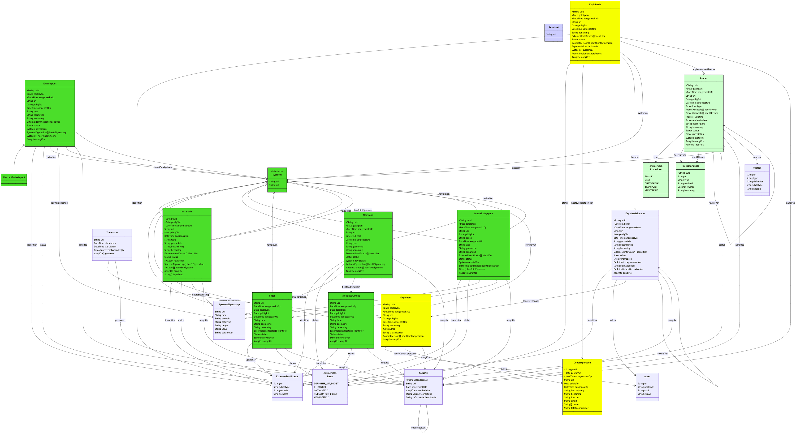
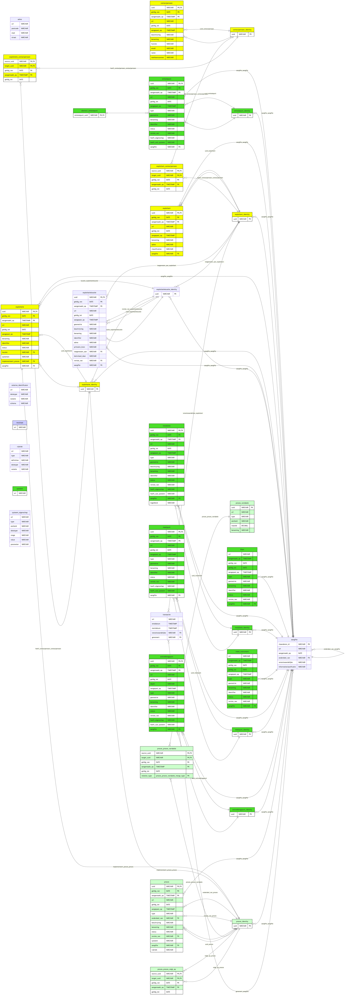

# Generated Examples

This page contains exported files generated from the test fixture configuration in `src/test/resources/application.yml`.

The examples used in this page are stored in stable docs paths:

- `docs/examples/riepr/ontology/`
- `docs/examples/riepr/outputs/`
- `docs/images/generated/`

## Refresh examples from tests

Run the generator tests and then sync the committed documentation examples:

```bash
./mvnw -Dtest='*GeneratorTest,DataFrameGeneratorTest,ClassGeneratorTest,ERDiagramGeneratorTest,SQLGeneratorTest,JavaGeneratorTest,TypescriptGeneratorTest,ShaclGeneratorTest' test
./scripts/update-doc-examples.sh
```

## Ontology input files

- Namespace ontology: `docs/examples/riepr/ontology/ns/riepr/riepr.ttl`
- Concept ontology: `docs/examples/riepr/ontology/id/concept/riepr/riepr.ttl`

## Diagram screenshots

### Class Diagram (`docs/images/generated/class-diagram-test.png`)



### ER Diagram (`docs/images/generated/er-diagram-test.png`)



## Mermaid source

### Class Diagram (`docs/examples/riepr/outputs/class-diagram.mmd`)

```mermaid
<<< ../examples/riepr/outputs/class-diagram.mmd
```

### ER Diagram (`docs/examples/riepr/outputs/er-diagram.mmd`)

```mermaid
<<< ../examples/riepr/outputs/er-diagram.mmd
```

## SQL example (`docs/examples/riepr/outputs/schema.sql`)

```sql
<<< ../examples/riepr/outputs/schema.sql
```

## SHACL example (`docs/examples/riepr/outputs/schema.ttl`)

```turtle
<<< ../examples/riepr/outputs/schema.ttl
```

## Java example (`docs/examples/riepr/outputs/Exploitatie.java`)

```java
<<< ../examples/riepr/outputs/Exploitatie.java
```

## TypeScript example (`docs/examples/riepr/outputs/exploitatie.model.ts`)

```typescript
<<< ../examples/riepr/outputs/exploitatie.model.ts
```

## DataFrame example (`docs/examples/riepr/outputs/frame.json`)

```json
<<< ../examples/riepr/outputs/frame.json
```
