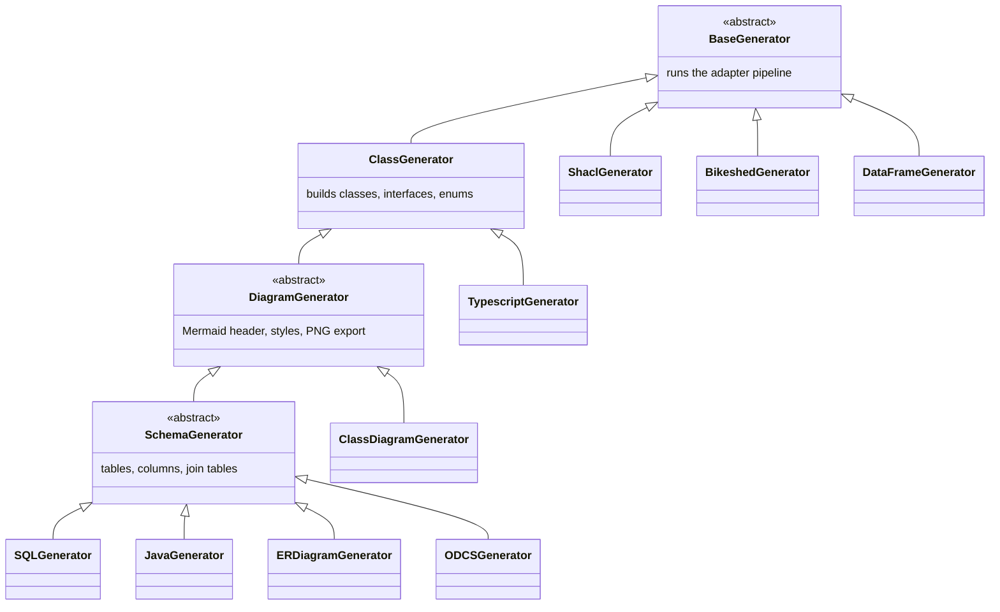

# Generators

A generator turns the ontology model into one concrete artefact: a diagram, a SQL schema, Java
classes, a specification document, and so on. You pick one with `--generator=NAME`, or run every
registered generator with `--generator=all`.

```bash
java -jar target/oddtoolkit.jar --generator=sql --config-file=config.yml
```

Each generator reads its own section under `generators.` in the configuration file. Two shared
sections, `generators.diagram-generator` and `generators.schema-generator`, are read by several
generators at once — see [Shared configuration](#shared-configuration).

## The ten generators

| Name | Produces | Config prefix |
| --- | --- | --- |
| `class` | In-memory class model only; writes no file | `generators.class` (adapter selection only) |
| `class-diagram` | Mermaid `classDiagram` source | `generators.class-diagram` |
| `er-diagram` | Mermaid `erDiagram` source (`.mmd`) plus a `.png` next to it | `generators.er-diagram` |
| `sql` | SQL DDL script (`.sql`) | `generators.sql-generator` |
| `shacl` | SHACL shapes in Turtle (`.ttl`) | `generators.shacl-generator` |
| `java` | One `.java` file per class, interface and enum | `generators.java-generator` |
| `typescript` | One `.ts` file per class, interface and enum | `generators.typescript-generator` |
| `data-frame` | JSON-LD frame + context (`.json`) | `generators.data-frame-generator` |
| `bikeshed` | Bikeshed specification source (`.bs`) | `generators.bikeshed-generator` |
| `odcs` | Open Data Contract Standard contract (`.json`) | `generators.odcs-generator` |

Generator names are not the same strings as the config prefixes. `sql` reads
`generators.sql-generator`, `shacl` reads `generators.shacl-generator`, and so on. Only
`class-diagram` and `er-diagram` use the same string for both.

### Writing to stdout

`class-diagram`, `er-diagram`, `sql`, `shacl`, `data-frame`, `bikeshed` and `odcs` print their
result to standard output when no output path is configured. That makes them easy to pipe:

```bash
java -jar target/oddtoolkit.jar --generator=shacl --ontology-file=my.ttl > shapes.ttl
```

`java` and `typescript` have no stdout mode — they always write a directory of files and require
`output-directory` to be set. `class` produces no output at all; it exists so you can run the
extraction pipeline on its own.

::: warning `filter-interfaces` has no effect
`generators.class-diagram.filter-interfaces` is bound but never read: `ClassGenerator` always
filters interfaces. Setting it to `false` does not change the output.
:::

## Class hierarchy

Generators inherit behaviour. Knowing where a generator sits tells you which shared configuration
sections apply to it.



Read it as: everything runs the adapter pipeline from `BaseGenerator`. Everything below
`ClassGenerator` gets the class/interface/enum model. Everything below `DiagramGenerator` reads
`generators.diagram-generator`. Everything below `SchemaGenerator` reads
`generators.schema-generator` and works with tables instead of classes.

## `class`

Runs the [adapter pipeline](./adapters) and builds the class model — classes, interfaces, enums,
attributes, relations — without emitting anything. Use it to check that your ontology and overrides
produce the model you expect before running a real generator.

| Key | Default | Meaning |
| --- | --- | --- |
| `adapters` | all enabled adapters | Adapter subset for this generator |

The `data-frame` generator reads its adapter list from `generators.class` too, not from
`generators.data-frame-generator`.

```yaml
generators:
  class:
    adapters:
      - "ontology-load"
      - "ontology-class-extract"
      - "ontology-property-extract"
```

## `class-diagram`

Emits a Mermaid `classDiagram`: one block per class, interface and enum, with attributes, typed
associations and inheritance arrows. Enum members are listed instead of attributes. Styles from
`generators.diagram-generator.styles` are applied here.

| Key | Default | Meaning |
| --- | --- | --- |
| `output-file` | none | Where to write the `.mmd`; prints to stdout when unset |
| `filter-interfaces` | `true` | Bound but not read — see the warning above |

Do not add an `adapters` key here — it aborts the run. See
[Selecting adapters per generator](#selecting-adapters-per-generator).

```yaml
generators:
  class-diagram:
    output-file: "target/class-diagram.mmd"
```

Style the diagram through `generators.diagram-generator.styles`. With no `output-file` you can
redirect stdout instead:

```bash
java -jar target/oddtoolkit.jar --generator=class-diagram --config-file=config.yml > class-diagram.mmd
```

## `er-diagram`

Emits a Mermaid `erDiagram` of the relational schema derived from the ontology: tables, columns
with PK/FK markers, and cardinality-annotated relations. This is a Mermaid file, not PlantUML.

When `output-file` is set, the `.mmd` file is written and a matching `.png` is rendered next to it
unless you disable [PNG export](#png-export).

| Key | Default | Meaning |
| --- | --- | --- |
| `output-file` | none (stdout) | Path of the `.mmd` file |

Also reads `generators.diagram-generator` and `generators.schema-generator`. Do not add an
`adapters` key here — it aborts the run. See
[Selecting adapters per generator](#selecting-adapters-per-generator).

```yaml
generators:
  er-diagram:
    output-file: "target/er-diagram/er-diagram.mmd"
```

## `sql`

Emits a SQL DDL script: enum types, tables, primary keys, foreign keys and join tables. The script
is prefixed with a comment header naming the source ontology and generation timestamp.

| Key | Default | Meaning |
| --- | --- | --- |
| `output-file` | none (stdout) | Path of the `.sql` file |

There is no dialect option. Table and column shaping is controlled entirely by
`generators.schema-generator`.

```yaml
generators:
  sql-generator:
    output-file: "target/sql/schema.sql"
```

## `shacl`

Emits SHACL node and property shapes derived from the ontology classes and their properties. The
output is Turtle, serialised by Jena.

| Key | Default | Meaning |
| --- | --- | --- |
| `output-file` | none (stdout) | Path of the `.ttl` file |

```yaml
generators:
  shacl-generator:
    output-file: "target/shacl/schema.ttl"
```

## `java`

Writes one `.java` file per class, interface and enum into `output-directory`. Interfaces are
written as `I<Name>.java`. Imports for cross-package dependencies are generated, and Jackson
`@JsonProperty` annotations are added to classes that have attributes.

| Key | Default | Meaning |
| --- | --- | --- |
| `output-directory` | none — **required** | Target directory for the generated files |
| `package-name` | `be.vlaanderen.omgeving.oddtoolkit.generated` | Package declared in every file |
| `cleanup-stale-files` | `false` | Delete `.java` files in the directory that this run would not produce |

Also reads `generators.schema-generator` (it uses the table model to resolve column names and
identifiers).

```yaml
generators:
  java-generator:
    package-name: "be.vlaanderen.omgeving.riepr.model.structuur"
    output-directory: "target/java"
    cleanup-stale-files: true
```

## `typescript`

Writes one `.ts` file per class, interface and enum into `output-directory`, using
`<lowercase-name>.model.ts`, `<lowercase-name>.interface.ts` and `<lowercase-name>.enum.ts`.

| Key | Default | Meaning |
| --- | --- | --- |
| `output-directory` | none — **required** | Target directory for the generated files |
| `cleanup-stale-files` | `false` | Delete `.ts` files in the directory that this run would not produce |

There is no package or module-name option.

```yaml
generators:
  typescript-generator:
    output-directory: "target/typescript"
    cleanup-stale-files: true
```

## `data-frame`

Emits a JSON-LD frame: an `@context` mapping every property name to its URI, an `@type` array
listing every ontology class and concept URI, and a frame entry per property. Use it to reshape
JSON-LD payloads into the flat structure the ontology describes.

| Key | Default | Meaning |
| --- | --- | --- |
| `output-file` | none (stdout) | Path of the `.json` file |

Adapter selection for this generator comes from `generators.class.adapters`.

```yaml
generators:
  data-frame-generator:
    output-file: "target/dataframe/frame.json"
```

## `bikeshed`

Emits a Bikeshed source document (`.bs`) with a metadata block, an introduction, a namespaces
section and a section per class. You then run the file through Bikeshed to get W3C-style HTML.

| Key | Default | Meaning |
| --- | --- | --- |
| `output-file` | none (stdout) | Path of the `.bs` file |
| `title` | ontology name | Spec title in the metadata block |
| `status` | `LS` | Spec status: `LS`, `ED`, `WD`, `CR`, `PR`, `REC` |
| `shortname` | local name of the ontology URI | Slug used by Bikeshed for the TR URL |
| `editor-name` | none | Editor name in the metadata block |
| `editor-email` | none | Editor e-mail |
| `editor-affiliation` | none | Editor organisation |
| `abstract-text` | ontology `rdfs:comment` | Extra abstract text |
| `markdown-files` | none | Explicit list of Markdown files to include, in order |
| `markdown-directory` | none | Directory whose `.md` files are included alphabetically |
| `markdown-section-title` | `Additional Documentation` | Heading for the included Markdown |
| `markdown-append-after-classes` | `true` | `true` inserts after the classes section, `false` appends at the end |
| `markdown-convert-tables` | `true` | Convert GFM pipe tables to `<table class="data">` |

All `markdown-*` keys are direct children of `bikeshed-generator`. If both `markdown-files` and
`markdown-directory` are set, only `markdown-files` is used and a warning is logged. In
`markdown-directory` mode, `README.md` is skipped.

```yaml
generators:
  bikeshed-generator:
    output-file: "target/bikeshed/ontology.bs"
    title: "RIE-IEPR Ontology"
    status: "LS"
    editor-name: "ODDToolkit"
    editor-affiliation: "Vlaamse overheid"
    markdown-directory: "docs/examples/riepr/documentation/afname/"
    markdown-section-title: "Additional Documentation"
    markdown-append-after-classes: true
    markdown-convert-tables: true
```

## `odcs`

Emits an Open Data Contract Standard document in JSON, describing the schema derived from the
ontology together with contract metadata.

| Key | Default | Meaning |
| --- | --- | --- |
| `output-file` | none (stdout) | Path of the `.json` file |
| `contract-name` | `Data Contract` | Contract name in `info` |
| `contract-version` | `1.0.0` | Contract version in `info` |
| `contract-description` | none | Contract description |
| `owner-name` | none | Owner block is only emitted when this is set |
| `owner-email` | none | Owner e-mail, only used with `owner-name` |
| `contact-name` | none | Contact block is only emitted when this is set |
| `contact-email` | none | Contact e-mail, only used with `contact-name` |

Also reads `generators.schema-generator` and `generators.diagram-generator`.

```yaml
generators:
  odcs-generator:
    output-file: "target/odcs/contract.json"
    contract-name: "RIE-IEPR Data Contract"
    contract-version: "1.0.0"
    contract-description: "Open Data Contract for RIE-IEPR ontology"
    owner-name: "Team Omgeving"
    owner-email: "team@example.org"
```

## Shared configuration

### `generators.diagram-generator`

Read by every generator that derives from `DiagramGenerator`: `class-diagram`, `er-diagram`, `sql`,
`java` and `odcs`. In practice the styles are only rendered by the two diagram generators, and PNG
export only fires when a diagram file is actually written.

| Key | Default | Meaning |
| --- | --- | --- |
| `output-file` | none | Reserved; individual diagram generators use their own `output-file` |
| `export-png` | `true` | Render a PNG next to each written diagram |
| `styles` | empty | List of style entries applied to matching classes |

Each style entry has:

| Key | Meaning |
| --- | --- |
| `name` | Mermaid `classDef` name |
| `uri` | Single class URI this style applies to |
| `uris` | List of class URIs; takes precedence over `uri` |
| `props` | Map of Mermaid style properties, for example `fill` and `stroke` |

A style also matches subclasses of the listed URIs, so styling a base class colours its whole
subtree.

```yaml
generators:
  diagram-generator:
    export-png: false
    styles:
      - name: "system"
        uri: "http://www.w3.org/ns/ssn/System"
        props:
          fill: "#4bde2a"
          stroke: "#000000"
      - name: "procedure"
        uris:
          - "http://www.w3.org/ns/sosa/Procedure"
          - "http://purl.org/net/p-plan#Variable"
        props:
          fill: "#ccffcc"
          stroke: "#000000"
```

#### PNG export

`export-png` defaults to `true`. PNG rendering uses Playwright: it launches a headless Chromium and
loads the Mermaid library from a CDN, so the first run downloads a browser and needs network
access. If Playwright is unavailable the generator logs a warning and continues without the PNG.

Turn it off when you only want the `.mmd` file, or when you build in an offline or minimal
environment:

```yaml
generators:
  diagram-generator:
    export-png: false
```

### `generators.schema-generator`

Read by every generator that derives from `SchemaGenerator`: `sql`, `java`, `er-diagram` and
`odcs`. It controls how ontology classes and relations become tables and columns.

| Key | Default | Meaning |
| --- | --- | --- |
| `join-table-name-pattern` | `rel_{source_table}_{target_table}` | Name of a many-to-many join table |
| `join-table-columns.source-column-name-pattern` | `source_{column}` | Name of the source identifier column in a join table |
| `join-table-columns.target-column-name-pattern` | `target_{column}` | Name of the target identifier column in a join table |
| `merge-join-tables.enabled` | `true` | Merge multiple relations between the same pair of classes into one join table |
| `merge-join-tables.attribute-name` | `relation_type` | Discriminator column added to a merged join table |
| `merge-join-tables.excluded-pairs` | empty | List of `{source-uri, target-uri}` pairs that are never merged |
| `identity-tables.enabled` | `true` | Create a stable identity table for classes with more than one primary key |
| `identity-tables.table-name-suffix` | `identity` | Suffix appended to the identity table name |

The patterns accept `{source_table}`, `{target_table}` and `{column}` as placeholders.

The two column patterns are also accepted flat, directly under `schema-generator`, as
`source-column-name-pattern` and `target-column-name-pattern`. Both forms write to the same values;
prefer the nested `join-table-columns` form in new configuration.

```yaml
generators:
  schema-generator:
    join-table-name-pattern: "{source_table}_{target_table}"
    join-table-columns:
      source-column-name-pattern: "{source_table}_id"
      target-column-name-pattern: "{target_table}_id"
    identity-tables:
      enabled: true
      table-name-suffix: "identity"
    merge-join-tables:
      enabled: true
      attribute-name: "relation_type"
      excluded-pairs:
        - source-uri: "https://data.riepr.omgeving.vlaanderen.be/ns/riepr#Proces"
          target-uri: "https://data.riepr.omgeving.vlaanderen.be/ns/riepr#Proces"
```

If two columns in a generated table end up with the same name, schema generation fails with an
error naming the table. Self-referencing relations are the usual cause: give the source and target
patterns different shapes so they cannot collide.

## Selecting adapters per generator

Every generator runs the adapter pipeline before it produces output. Add an `adapters` list under
the generator's **name** to run only a subset:

```yaml
generators:
  shacl:
    adapters:
      - "ontology-load"
      - "ontology-class-extract"
      - "ontology-property-extract"
```

The lookup key is the generator name, not the config prefix. So it is `generators.shacl.adapters`,
never `generators.shacl-generator.adapters`:

| Generator | Adapter selection key |
| --- | --- |
| `class` | `generators.class.adapters` |
| `sql` | `generators.sql.adapters` |
| `shacl` | `generators.shacl.adapters` |
| `java` | `generators.java.adapters` |
| `typescript` | `generators.typescript.adapters` |
| `bikeshed` | `generators.bikeshed.adapters` |
| `odcs` | `generators.odcs.adapters` |
| `data-frame` | `generators.class.adapters` (shared with `class`) |
| `class-diagram` | not usable — see below |
| `er-diagram` | not usable — see below |

::: danger Never put `adapters` under `class-diagram` or `er-diagram`
For these two the generator name and the config prefix are the same string, so the section is also
bound to a typed properties class. `ConfigurationBinder` uses a strict Jackson mapper, so an
unknown key throws `IllegalArgumentException: Unrecognized field "adapters"` and the run aborts
before any generator starts. Leave both sections at their documented keys and let these generators
run the full pipeline.
:::

Names that are unknown or disabled are skipped with a warning, and the subset is still sorted by
dependency order. This selection path has no test coverage and no sample configuration exercises
it, so verify the log line listing the adapters that actually ran. See [Adapters](./adapters) for
the full list and the ordering rules.

## See also

- [Adapters](./adapters) — the pipeline that builds the model every generator consumes
- [Configuration Reference](./configuration) — the `ontology.*` section and file formats
