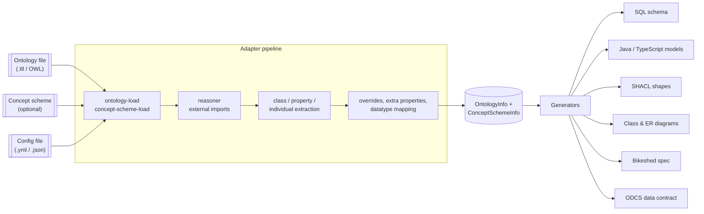

# Introduction

ODDToolkit (Ontology Driven Design Toolkit) turns an OWL/RDF ontology into the artefacts that
normally sit downstream of a domain model: a SQL schema, Java and TypeScript classes, SHACL
shapes, Mermaid class and ER diagrams, a Bikeshed specification and an ODCS data contract.

You maintain one thing — the ontology. Everything else is regenerated from it.

## Why it exists

In most projects the domain model is written down several times: once in a diagram, once in a
database schema, once in the application's classes, once in a validation rule set, and once in
the specification nobody updates. Those copies drift. A column gets added to the database and
never reaches the API model; a cardinality changes in the spec and never reaches the validation
shapes.

ODDToolkit removes the copies. The ontology is the single source of truth, and each artefact is
an output of a generator run. If an artefact disagrees with the ontology, it is stale — you
regenerate it rather than patch it. That also means the artefacts stay consistent *with each
other*: the SQL table names, the JPA annotations in the generated Java, the ER diagram and the
ODCS contract all come from the same in-memory model.

## The pipeline

A run has three phases. First, the ontology (and, optionally, a SKOS concept scheme) is read from
disk into an Apache Jena model. Second, a pipeline of **adapters** walks that model and builds up
a normalised, in-memory representation — extracting classes, properties, individuals and URI
templates, optionally running a reasoner, pulling in imported external ontologies, and applying
the overrides you declared in configuration. Third, a **generator** renders that representation
into a concrete artefact. Adapters do the reading and enriching; generators only render. Every
generator shares the same adapter pipeline, which is why the outputs cannot disagree.



You drive the whole thing from one command:

```bash
java -jar target/oddtoolkit.jar --generator=all --config-file=config.yml
```

## What you get

Ten generators are registered. They fall into three groups:

- **Schema-shaped output** — `sql`, `java`, `er-diagram` and `odcs` all derive a table/column
  model from the ontology, so they agree on table names, primary keys and join tables.
- **Class-shaped output** — `class-diagram` and `typescript` work at the class level, with
  interfaces, enumerations and inheritance. `class` sits underneath them and only builds the
  in-memory class model; it writes no file of its own.
- **Document and data output** — `shacl`, `bikeshed` and `data-frame`.

See [Generators](./generators) for the exact output of each one.

## Assumptions

- The toolkit is a plain Java 21 command-line application built with Maven; there is no server
  and no daemon.
- Configuration lives in a YAML or JSON file. Only the ontology and concept-scheme paths can be
  overridden on the command line.
- Adding a generator or an adapter means editing the source and rebuilding — there is no plugin
  discovery mechanism. See [Extending](./extending).

## Where to go next

- [Installation](./installation) — build the jar and check your toolchain.
- [Quick Start](./quickstart) — run your first generator against the bundled example ontology.
- [CLI Reference](./cli) — every option the command line accepts.
- [Configuration Reference](./configuration) — the full config file schema.
- [Generators](./generators) — what each generator emits and how to configure it.
- [Adapters](./adapters) — the pipeline stages and their settings.
- [Ontology & Metadata](./ontology-metadata) — the ontology conventions the toolkit reads.
- [Generated Examples](./examples) — real output from the example ontology.
- [Architecture](./architecture) — how the toolkit is wired internally.
- [Extending](./extending) — add your own generator or adapter.
- [License](./license) — GNU GPL v3.
